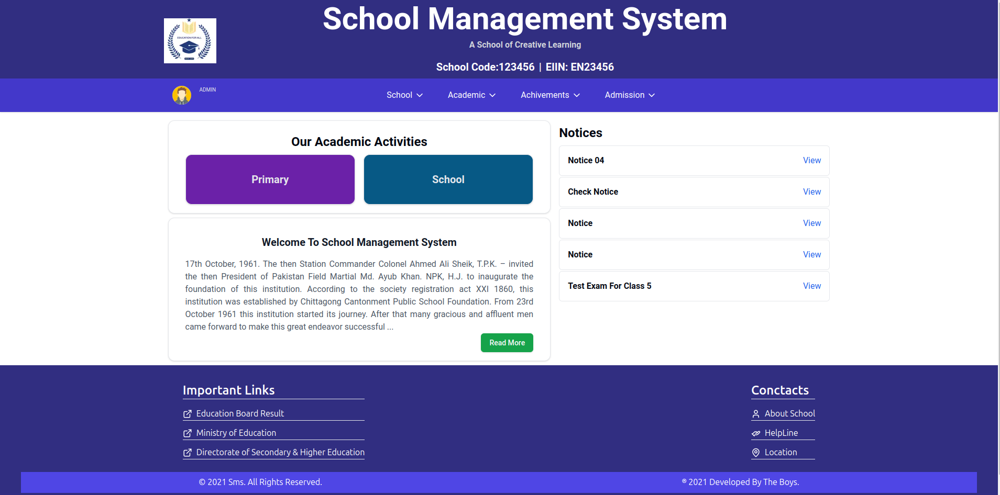
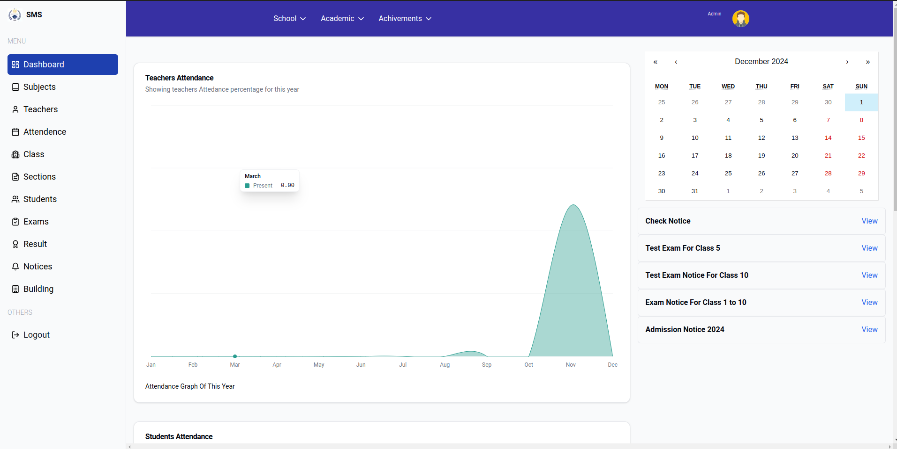
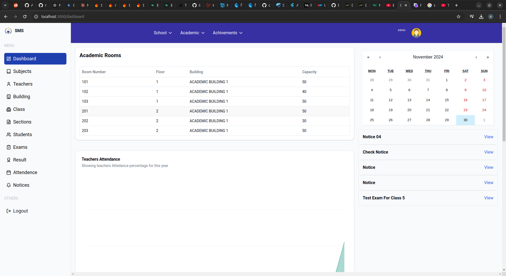
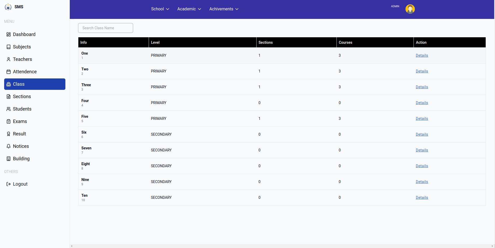
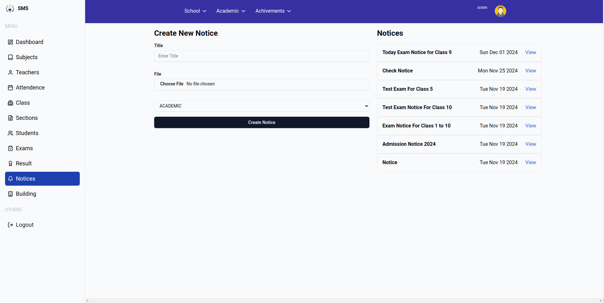
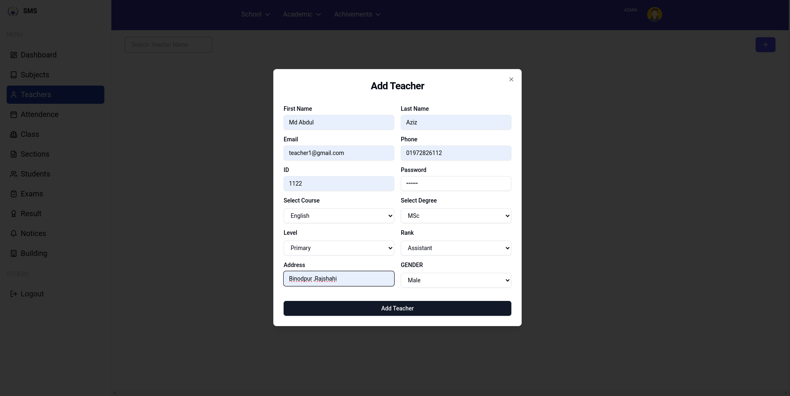
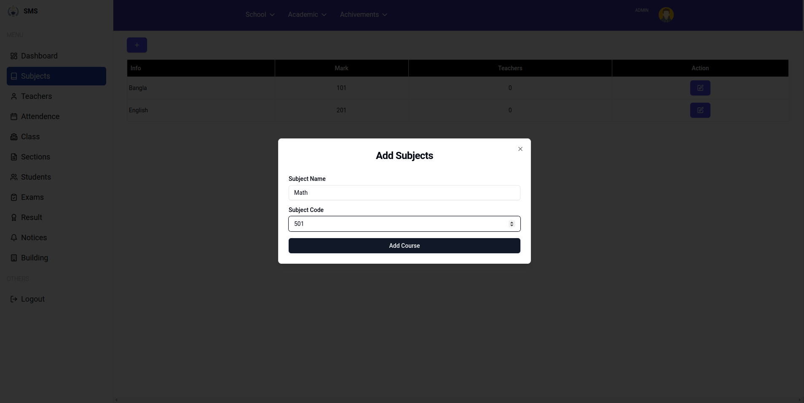
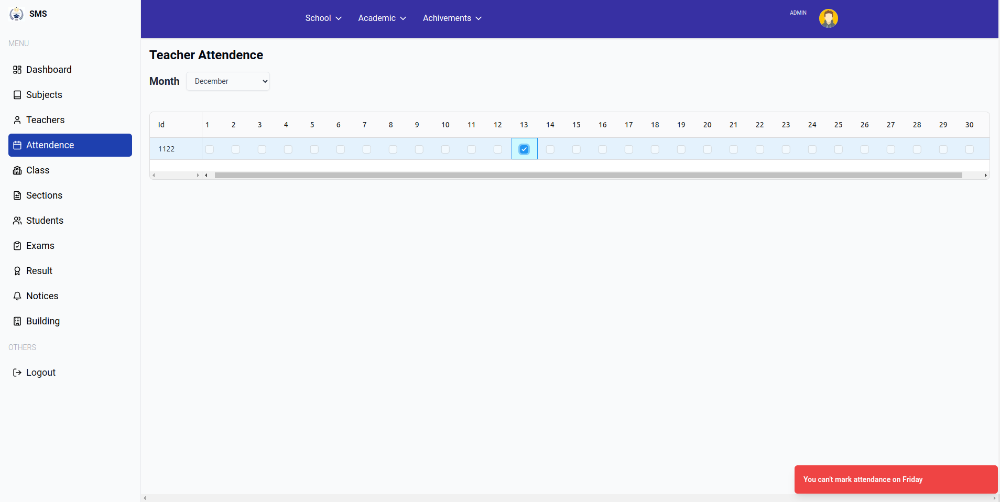
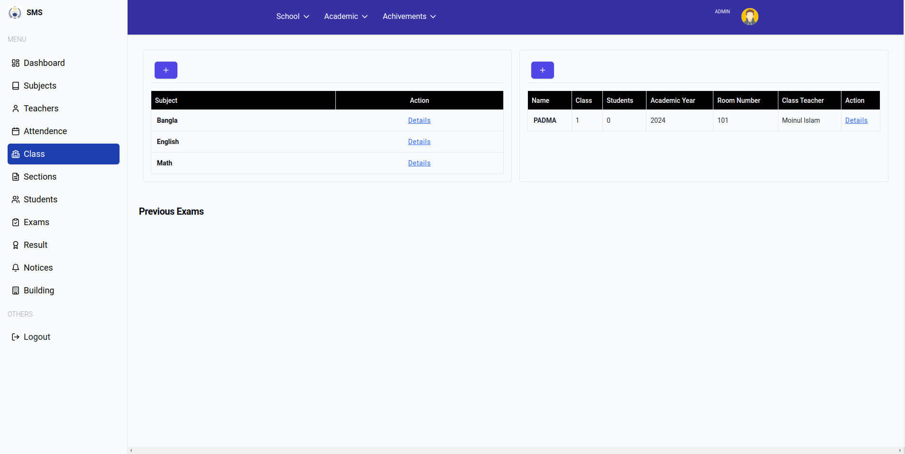
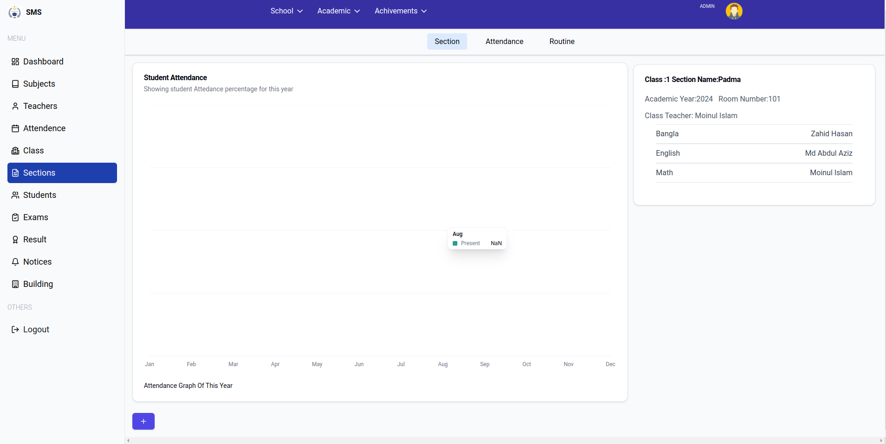

# School Management System

**If You get any Problem on main Branch clone dev1 branch**

This is school management system which built on next js, prisma ,mysql.

Some Features of this project:

1. Role Based Login(Admin,Teacher,Student)
2. Admin can create/update,delete

- Rooms
- Subjects
- Student
- Teachers
- Notice
- Class Schedule
- Section
- mark attendance,Teacher
- Exam
- Publish Result

3. Teacher

- View Schedule & Notice
- View attendance and give attendace on time 10AM-12PM
- Take Attendance of section which section he is enrolled

4.

- View Schedule,Attendance,Result & Notice

first clone the project then configure .env like .env.example file then install all dependency by

```
npm install
```

After installing all dependency migrate all schemas

```
npx prisma migrate dev --name init
or
npx prisma db push
```

Then run server

```
npm run dev
```

## User Interface Desing

<div>


</div>

<div>


</div>
<div>


</div>

<div>


</div>

<div>


</div>
